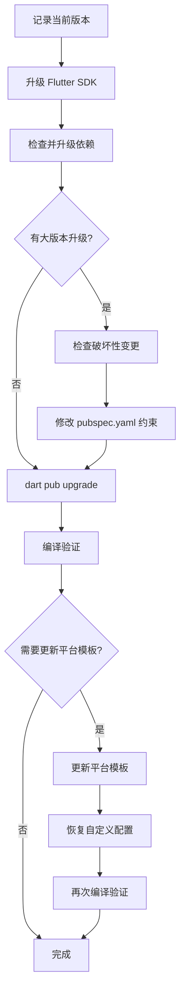

# Flutter 全量升级

Flutter 项目的完整升级流程，包括 SDK、依赖和平台模板代码。

## 升级流程



## 升级原则

- 目标是升级到当前 Flutter 工具链正常支持的最新版本，不为了追更高版本强制覆盖 SDK 约束，也不通过主动降级绕过问题。
- SDK、Melos、Git 权限、沙箱、CocoaPods 环境这类基础工具链问题必须先报告具体命令和错误，再继续处理；不要私自换命令、跳过工具或改用非预期路径绕过。
- 代码 API 破坏性变更可以直接修；如果涉及平台模板、权限、签名、entitlements、Bundle ID、包名等高风险平台文件，必须先明确风险和当前状态。
- 每完成一段有意义的升级调整就提交一次，提交信息说明真实意图；阶段性提交可以不保证全部编译通过，但必须记录当前验证结果。
- 第一阶段以编译通过为目标，功能回归和平台模板重建可以后置，但不要隐藏已发现的风险。

## 升级 Flutter SDK

```bash
# 记录升级前版本
flutter --version
dart --version

# 升级 SDK（本地有修改时需要 --force）
flutter upgrade
# 或
flutter upgrade --force

# 确认升级后版本 + 环境状态
flutter doctor
```

### SDK 处理边界

| 场景 | 处理方式 |
|------|----------|
| Flutter 版本低于依赖最低要求 | 升级 Flutter SDK，不要降级依赖绕过 |
| 依赖要求高于当前 stable SDK 能支持的范围 | 停止并报告该依赖、要求的 SDK 版本和当前 Flutter 最新可用版本 |
| `flutter upgrade` 失败 | 保留完整命令和核心错误，先报告再决定是否 `--force` |
| `flutter doctor` 显示平台工具缺失 | 报告缺失项；只处理明确允许自动修复的项 |

## 检查并升级依赖

```bash
# 检查所有过时依赖（在 workspace 根目录执行）
dart pub outdated

# 各子模块也可单独检查
cd <app模块路径> && flutter pub outdated
```

### 依赖分类处理

| 类别 | 判断方法 | 处理方式 |
|------|----------|----------|
| 约束内可升级 | Upgradable 列有新版本 | `dart pub upgrade` 自动升级 |
| 大版本升级 | Resolvable 列有新版本但 Upgradable 没有 | 需手动修改 pubspec.yaml 约束 |
| SDK 锁定 | Resolvable 也没有新版本 | 无法升级，等 Flutter SDK 更新 |

### 大版本升级检查

修改约束前，必须确认破坏性变更不影响现有代码：

1. 访问 `https://pub.dev/packages/{包名}/changelog` 查看 BREAKING CHANGE
2. 搜索项目中该包的实际使用方式（`grep -rn 'import.*包名' lib/`）
3. 对照破坏性变更列表，逐条确认是否影响当前用法

```bash
# 修改约束后执行升级
dart pub upgrade
```

### Melos workspace 要求

Melos 项目必须直接使用 `melos` 命令，不要用 `dart run melos` 代替。`melos` 命令不可用时，报告以下信息后再处理环境：

```bash
which melos
melos --version
melos list
```

常用升级验证命令：

```bash
dart pub get
melos list
melos analyze
melos exec --concurrency 1 --dir-exists=test -- "flutter test --no-pub --coverage"
```

### 第三方 fork 或 vendored 包

升级遇到复制进仓库的第三方库时，优先判断能否回归 pub 最新版，而不是继续维护本地 fork。

处理顺序：

1. 用 `git log -- <路径>` 找出引入 fork 后的本地修改提交。
2. 对比本地修改与上游 changelog、pub 最新版功能，判断原 bug 是否已被上游修复。
3. 先尝试切回 pub 最新版并删除 workspace 中的 vendored 包。
4. 跑 `dart pub get`，根据依赖解析冲突决定是调整直接依赖约束，还是保留 fork。
5. 通过 `melos analyze`、测试和目标平台 build 后再提交。

依赖解析冲突要按实际约束处理。若上游最新版仍限制旧版传递依赖，可以接受该约束以换取回归官方包；但不能为了隐藏冲突而添加无解释的 `dependency_overrides`。

## 编译验证

加载 `flutter-build` skill 执行编译。

最低验证集：

```bash
dart pub get
melos analyze
melos exec --concurrency 1 --dir-exists=test -- "flutter test --no-pub --coverage"
```

App 模块还需要至少验证一个目标平台：

```bash
cd <app模块路径>
flutter build macos --debug
```

如果验证命令自动改动锁文件、Pods 文件或平台工程文件，必须在提交前检查 `git diff`，确认这些改动来自依赖解析或 Flutter 工具生成。

## 更新平台模板代码

Flutter 各平台目录（android/、ios/、macos/ 等）在 `flutter create` 时生成，之后不会自动更新。

### 检查模板版本

```bash
# 查看项目创建时的 SDK revision
cat <app模块路径>/.metadata
```

### 更新方式

| 方式 | 命令 | 说明 |
|------|------|------|
| 仅补充新文件 | `flutter create .` | 安全，不覆盖已有文件 |
| 全量覆盖 | `flutter create --overwrite --org <org> --project-name <name> .` | 用最新模板覆盖所有平台文件 |

### 全量覆盖的关键步骤

全量覆盖会重置所有文件（包括你的代码），必须按以下流程操作：

```bash
# 1. 先暂存当前工作区变更
git stash push -m "pre-template-update"

# 2. 在 app 目录执行覆盖（--org 和 --project-name 需与原项目一致）
cd <app模块路径>
flutter create --overwrite --org <org> --project-name <name> .

# 3. 立即恢复被覆盖的项目文件
git checkout -- pubspec.yaml lib/ analysis_options.yaml README.md

# 4. 回到 workspace 根目录，恢复暂存的变更
cd <workspace根目录>
git stash pop

# 5. 检查并恢复自定义配置（见下方检查清单）
```

### 自定义配置检查清单

全量覆盖后必须逐项检查以下文件：

| 文件 | 检查内容 |
|------|----------|
| `macos/Runner/DebugProfile.entitlements` | 模板会添加 `app-sandbox`，若项目不使用沙箱必须删除；自定义权限（如 `files.user-selected.read-write`）是否被删除 |
| `macos/Runner/Release.entitlements` | 同上 |
| `ios/Runner/Info.plist` | 自定义权限描述（相机、相册等）是否被删除 |
| `android/app/src/main/AndroidManifest.xml` | 自定义权限声明是否被重置 |
| `android/app/build.gradle.kts` | namespace/applicationId 是否正确 |
| `macos/Runner/Configs/AppInfo.xcconfig` | 应用名称、Bundle ID 是否正确 |

```bash
# 用 git diff 检查所有平台变更
git diff -- <app模块路径>/macos/Runner/*.entitlements
git diff -- <app模块路径>/ios/Runner/Info.plist
git diff -- <app模块路径>/android/
```

### CocoaPods 处理

Flutter 或插件大版本升级后，iOS/macOS 常见失败点是 Pod 版本锁定。允许优先更新相关 Pod，再视情况删除不重要的 lock 文件重试。

```bash
cd <app模块路径>/macos
pod update <PodName>

# 多个底层 Pod 冲突时一起更新
pod update <PodName> <RelatedPodName>
```

处理要求：

- `Podfile.lock` 可随依赖升级提交，但必须确认变化来自 `pod update` 或 Flutter build。
- 不要把 Pods deployment target warning 当成成功阻断；只要 build 通过，可记录为后续平台模板清理项。
- entitlements、Info.plist、Xcode project 的权限和签名配置不能因为 Pod 问题被随意删除。

### 清理旧文件

```bash
# 如果 Android 包名从 com.example 变为正确包名，删除旧目录
rm -rf android/app/src/main/kotlin/com/example
```

## 常见问题

| 问题 | 原因 | 解决 |
|------|------|------|
| `flutter upgrade` 提示 local changes | Flutter SDK 目录有本地修改 | 使用 `--force` 参数 |
| `git checkout --` 恢复多个文件时部分失败 | 其中一个 pathspec 不存在导致整条命令失败 | 确保所有路径存在，或分多次执行 |
| 覆盖后 entitlements 丢失权限 | 模板只包含默认权限 | 手动恢复自定义权限 |
| 覆盖后 macOS 功能异常（文件访问被拒） | 模板添加了 `app-sandbox` 但项目不使用沙箱 | 从 entitlements 中删除 `app-sandbox` |
| `pubspec.lock` 没有 git diff | workspace 根目录的 pubspec.lock 被 gitignore | 这是正常行为 |
| 部分传递依赖无法升级 | 被 Flutter SDK 或其他包锁定 | 等 SDK 或上游包更新 |
| `melos` 命令不可用 | 全局 Melos 未安装或 PATH 未配置 | 报告 `which melos` 和 `melos --version` 结果，不要改用 `dart run melos` |
| pub 最新版依赖解析冲突 | 上游包约束了旧版传递依赖 | 优先按解析器提示调整直接依赖；无法判断时报告冲突树 |
| vendored 第三方库升级困难 | 本地 fork 已落后上游 | 先查本地 fork 修改历史，再尝试回归 pub 最新版 |
| Pod build 失败但 Dart 分析通过 | 原生依赖锁定或 Pod 版本不兼容 | 针对相关 Pod 执行 `pod update`，保留并审查 `Podfile.lock` 变化 |
